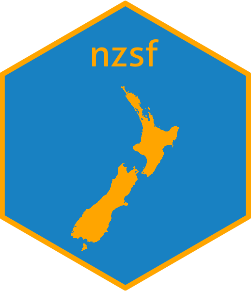

nzsf 
===============================================================

New Zealand Spatial Features (nzsf) is a package for plotting shapefiles. It can be installed from within R using:

    library(devtools)
    install_github("quantifish/nzsf", build_vignettes = TRUE)

You can view the package vignette from within R using:

    browseVignettes(package = "nzsf")
    vignette(package = "nzsf")

 The `nzsf` package can plot QMA boundaries for many New Zealand finfish and shellfish stocks:

| Species code | Common name           | Scientific name            | Maori name |
| ------------ |:---------------------:| -----:| -----:|
| HAK          | Hake                  | XXX | XXX |
| HOK          | Hoki                  | XXX | XXX |
| LIN          | Ling                  | XXX | XXX |
| OEO          | Oreo                  | XXX      | XXX |
| ORH          | Orange roughy         | *Hoplostethus atlanticus*      | XXX |
| SWA          | Silver warehou        | *Seriolella punctata*      | XXX |
| SBW          | Southern blue whiting | *Micromesistius australis* | XXX |

 * CRA - red rock lobster (*Jasus edwardsii*)
 * PHC - packhorse rock lobster (*Sagmariasus verreauxi*)
 * COC - cockle
 * PPI - pipi
 * PAU - paua (*Haliotis iris*)
 * SCA - scallop (*Pecten novaezealandiae*)
 
If you would like additional stocks added just let me know in the issues (please include a link to the shapefiles).
