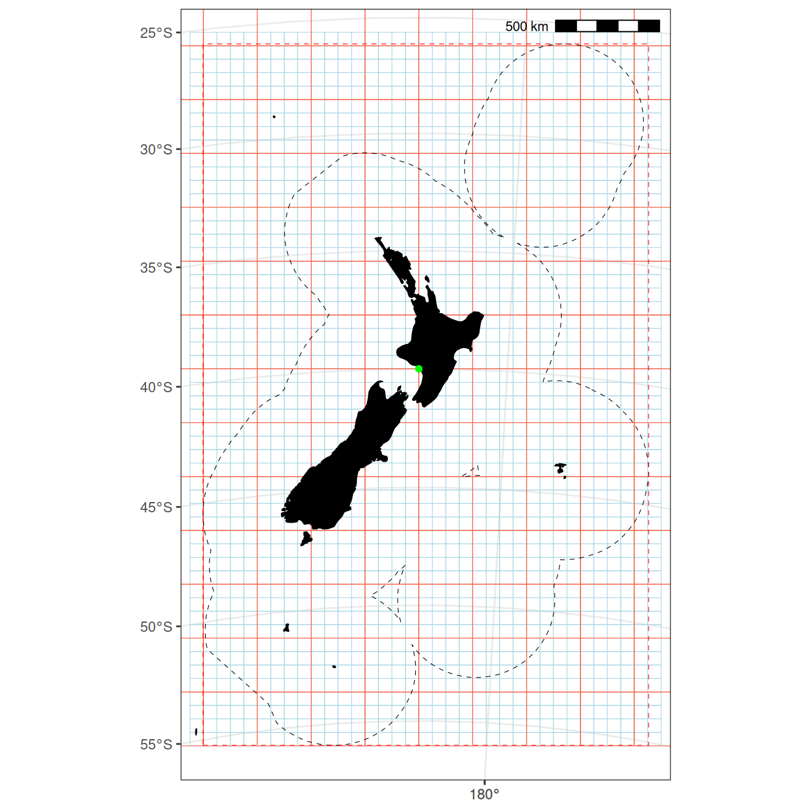
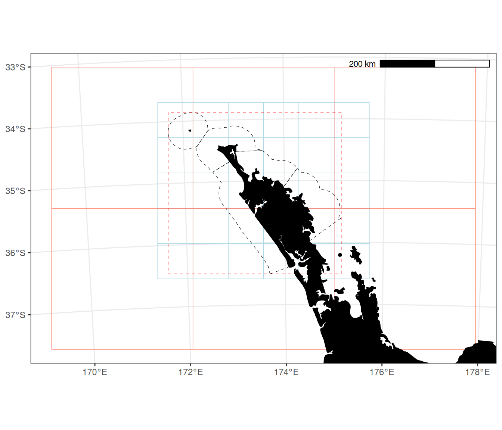
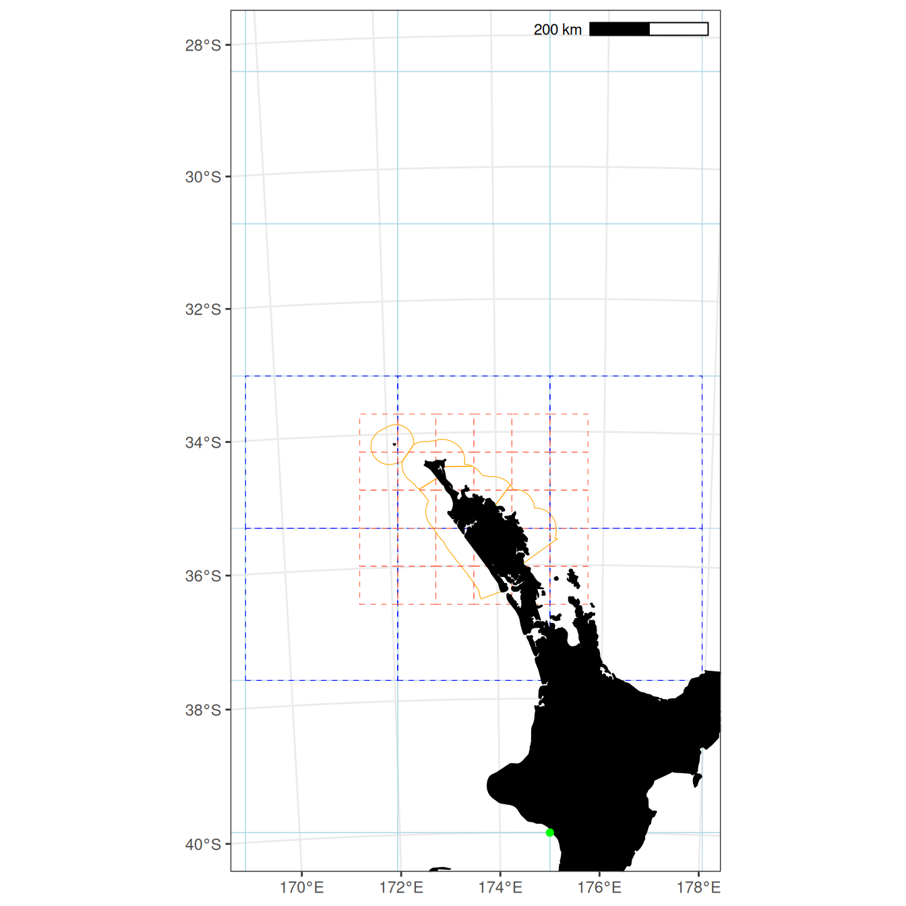
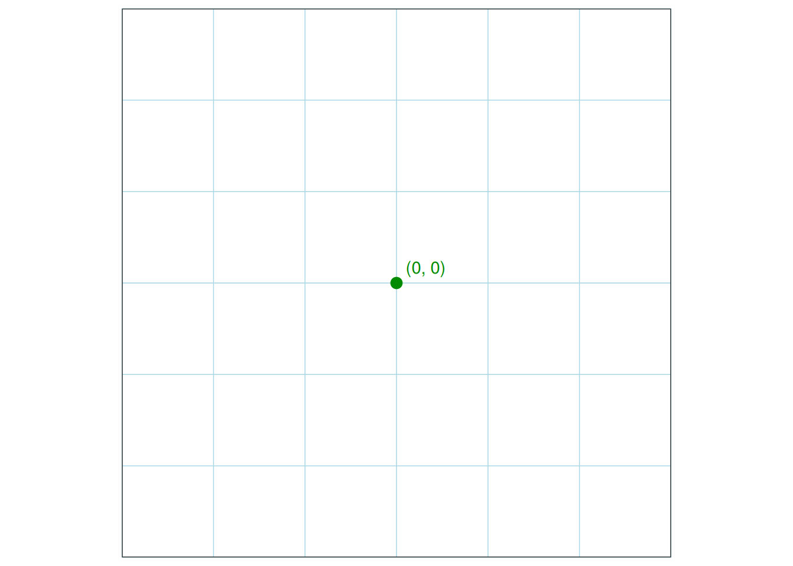
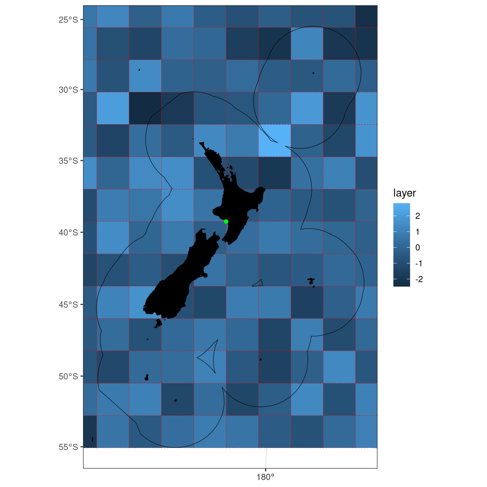

# Fisheries New Zealand standard grids

``` r

library(nzsf)
library(dplyr)
library(ggplot2)
library(ggspatial)
library(sf)
library(stars)

theme_set(theme_bw() + theme(axis.title = element_blank()))
```

The process is:

- Identify the area of interest (e.g., the New Zealand EEZ, a QMA)
- Place a bounding box around the area of interest
- Generate a standard grid, with the specified `cell_size`, that covers
  the bounding box

The standard grid can either be a simple feature collection of polygons
(`return_raster = FALSE`) or a raster (`return_raster = TRUE`). The
standard grid can extend beyond the range of the bounding box, depending
on the `cell_size`.

By default, the grid is anchored to the coordinate (0, 0) in EPSG:9191,
which is 175 degrees E, 40 degrees S. This coordinate is a shared cell
corner, so the supported cell sizes remain nested.

## Standard grids as polygons

``` r

eez <- get_statistical_areas(area = "EEZ", proj = proj_nzsf())
bb_eez <- st_bbox(eez) %>% st_as_sfc()
grd256_eez <- get_standard_grid(cell_size = 256, bounding_box = st_bbox(eez), 
                                return_raster = FALSE)
grd064_eez <- get_standard_grid(cell_size = 64, bounding_box = st_bbox(eez), 
                                return_raster = FALSE)
```

Plot and check with centre point and bounding box.

``` r

ggplot() +
  geom_sf(data = grd064_eez,  colour = "lightblue",  fill = NA, alpha = 0.15) +
  geom_sf(data = grd256_eez,  colour = "tomato",  fill = NA, alpha = 0.5) +
  plot_statistical_areas(area = "EEZ", colour = "black", fill = NA, linetype = "dashed") +
  geom_sf(data = bb_eez, colour = "red", fill = NA, linetype = "dashed") +
  plot_coast(resolution = "medium", fill = "black", colour = "black") +
  geom_point(aes(x = 0, y = 0), colour = "green") +
  plot_clip("NZ") +
  annotation_scale(location = "tr", unit_category = "metric")
```



Figure 1: The New Zealand EEZ (dashed black lines), a box bounding the
EEZ (dashed red lines), a 64 x 64 km grid (blue lines), a 256 x 256 km
grid (red lines), and the origin (green point).

``` r

cra1 <- get_statistical_areas(area = "CRA", proj = proj_nzsf()) %>% 
  filter(QMA %in% "CRA1")

bb_cra1 <- st_bbox(cra1) %>% st_as_sfc()

grd256_cra1 <- get_standard_grid(cell_size = 256, bounding_box = st_bbox(cra1), 
                                 return_raster = FALSE)

grd064_cra1 <- get_standard_grid(cell_size = 64, bounding_box = st_bbox(cra1), 
                                 return_raster = FALSE)

ggplot() +
  geom_sf(data = grd064_cra1,  colour = "lightblue",  fill = NA, alpha = 0.5) +
  geom_sf(data = grd256_cra1,  colour = "tomato",  fill = NA, alpha = 0.5) +
  geom_sf(data = cra1, colour = "black", fill = NA, linetype = "dashed") +
  geom_sf(data = bb_cra1, colour = "red", fill = NA, linetype = "dashed") +
  plot_coast(resolution = "large", fill = "black", colour = "black") +
  annotation_scale(location = "tr", unit_category = "metric") +
  plot_clip(x = grd256_cra1)
```



The CRA 1 QMA (dashed black), a box bounding around CRA 1 (dashed red),
a 64 x 64 km grid (blue), and 256 x 256 km grid (red). Note that there
is no point of origin shown as it is outside of the CRA 1 QMA.

Plot and check overlap of two grids.

``` r

ggplot() +
  geom_sf(data = grd256_eez,  colour = "lightblue",  fill = NA, alpha = 0.5) +
  geom_sf(data = cra1, colour = "orange", fill = NA) +
  geom_sf(data = grd256_cra1,  colour = "blue",  fill = NA, alpha = 0.5, linetype = "dashed") +
  geom_sf(data = grd064_cra1,  colour = "tomato",  fill = NA, alpha = 0.5, linetype = "dashed") +
  plot_coast(resolution = "high", fill = "black", colour = "black") +
  geom_point(aes(x = 0, y = 0), colour = "green") +
  annotation_scale(location = "tr", unit_category = "metric") +
  coord_sf(xlim = c(-5e+05, 2.5e+05), ylim = c(0, 1318000))
```



EEZ 256 x 256 km grid (light blue), CRA 1 256 x 256 km grid (dashed
blue), origin (green point).

In the figure below, I show that you can specify the number of cells
either side of the origin.

``` r

bb1 <- st_bbox(eez)
bb1[1] <- -3000 # xmin (3 cells west of the origin)
bb1[2] <- -3000 # ymin (3 cells south of the origin)
bb1[3] <- 3000 # xmax (3 cells east of the origin)
bb1[4] <- 3000 # ymax (3 cells north of the origin)

grd001_eez <- get_standard_grid(cell_size = 1, bounding_box = bb1, 
                                return_raster = FALSE)

# Plot and check the origin at fine scale
ggplot() +
  geom_sf(data = grd001_eez,  colour = "lightblue",  fill = NA, alpha = 0.15) +
  geom_point(aes(x = 0, y = 0), colour = "green4", size = 3) +
  annotate("text", x = 100, y = 100, label = "(0, 0)", colour = "green4",
           hjust = 0, vjust = 0) +
  coord_sf(datum = NA, expand = FALSE)
```



A 1 x 1 km grid (blue) surrounding the EPSG:9191 origin (green point).
The origin is a shared grid-cell corner.

## Standard grids as rasters

Rasters are more useful than polygons. Get standard grid as a raster.
Fill the grid with random values and plot it.

``` r

r <- get_standard_grid(cell_size = 256, bounding_box = st_bbox(eez), 
                       return_raster = TRUE)
r[] <- rnorm(n = raster::ncell(r))
rstar <- st_as_stars(r)

ggplot() +
  geom_stars(data = rstar) +
  geom_sf(data = grd256_eez, fill = NA, colour = "red", linetype = "dotted") +
  plot_coast(resolution = "large", fill = "black", colour = "black") +
  plot_statistical_areas(area = "EEZ", colour = "black", fill = NA) +
  geom_point(aes(x = 0, y = 0), colour = "green") +
  plot_clip("NZ")
```



EEZ 256 x 256 km grid as polygons (dotted red), EEZ 256 x 256 km grid as
raster (blue), origin (green point).
