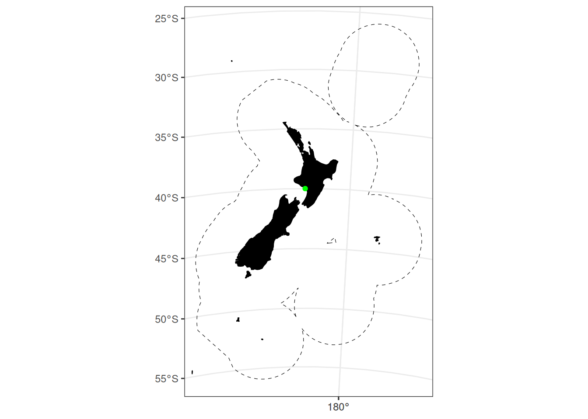

# Projections

``` r

library(nzsf)
theme_set(theme_bw() + theme(axis.title = element_blank()))
```

``` r

get_projection_center <- function(proj) {
  crs_info <- st_crs(proj)
  lat_0 <- as.numeric(gsub(".*lat_0=([-0-9.]+).*", "\\1", crs_info$input))
  lon_0 <- as.numeric(gsub(".*lon_0=([-0-9.]+).*", "\\1", crs_info$input))
  return(list(lon = lon_0, lat = lat_0))
}

x <- get_projection_center(proj_nzsf())

points_df <- data.frame(lon = x$lon, lat = x$lat) |>
  st_as_sf(coords = c("lon", "lat"), crs = 4326) |>
  st_transform(crs = proj_nzsf())

ggplot() +
  plot_statistical_areas(area = "EEZ", colour = "black", fill = NA, linetype = "dashed") +
  plot_coast(resolution = "medium", fill = "black", colour = "black") +
  geom_sf(data = points_df, colour = "green") + 
  plot_clip("NZ")
```



Figure 1: The New Zealand EEZ (dashed black lines) and the projection
centre (green point).
